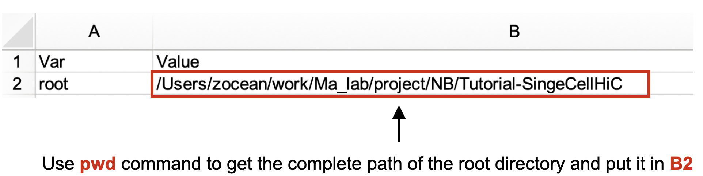
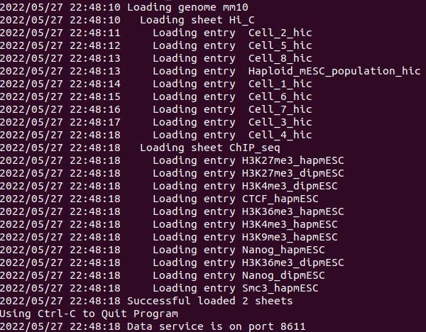

# Building a custom data service - An example using single-cell Hi-C data

This tutorial will show you how to set up a custom Nucleome Browser session.
You will learn how to pre-processe publised data (e.g., population Hi-C and single-cell Hi-C from Stevens et al. 2017) and lauch a local genomic data service and local 3D genome structure service for visualization in Nucleome Browser.
You can follow this tutorial by cloning this repo. 
We also provide a list of demo data and configuration file under the folder named `demo_data`
You can jump to the section named [Starting the data service with demo data](#start_demo) if you just want to know how to set up a local data service in your computer and visualize tracks on Nucleome Browser. 

## Table of Contents
1. [Requirements](#requirements)

2. [Getting data from GEO (Linux and macOS](#getdata)

3. [Pre-processing of ChIP-seq peaks](#preprocessing_chip)

4. [Pre-processing of population Hi-C and single-cell Hi-C data](#preprocessing_hic)

5. [Starting data service](#start_data)

6. [Starting data service using the demo data](#start_demo)

7. [Citation&Referene](#others)


<a name="requirements"/>

## Requirements
To follow the steps in this tutorial you will need to prepare a laptop or desktop on Linux or macOS.
You will also need to pre-install the following software packages/tools for different operating systems.

> Tips: For Windows machine, you need to install Windows Subsytem for Linux to pre-process the data.
However, you can start the data service with demo data without the linux subsystem. 
You can go the section named **Starting the data service with demo data** to see video tutorial on Windows machine.

### Linux (tested under Ubuntu 20.04.4 LTS)
- gzip 
- tar
- awk (mawk/gawk should also work)
- sed
- Juicer Tools ([https://github.com/aidenlab/juicer/wiki/Download](https://github.com/aidenlab/juicer/wiki/Download)), this tutorial is tested under Juicer Tool version 1.22.01
- fetchChromSizes and bedToBigBed (you can install these binaries built from [http://hgdownload.cse.ucsc.edu/admin/exe/](http://hgdownload.cse.ucsc.edu/admin/exe/) 
- nucleserver ([https://github.com/nucleome/nucleserver](https://github.com/nucleome/nucleserver)), this tutorial is tested under nucleserver version 0.2.6

### macOS (tested under macOS 12 (Monterey))
- gzip 
- tar
- gawk 
- sed
- Juicer Tools ([https://github.com/aidenlab/juicer/wiki/Download](https://github.com/aidenlab/juicer/wiki/Download)), this tutorial is tested under Juicer Tool version 1.22.01
- fetchChromSizes and bedToBigBed (you can install these binaries built from [http://hgdownload.cse.ucsc.edu/admin/exe/](http://hgdownload.cse.ucsc.edu/admin/exe/) 
- nucleserver ([https://github.com/nucleome/nucleserver](https://github.com/nucleome/nucleserver)), this tutorial is tested under nucleserver version 0.2.6

<a name="getdata"/>

## Getting data from GEO (Linux and macOS)
First, Open terminal in Linux or macOS.
Then, create a new folder ans use `wget` command to download the whole dataset from GEO to a local computer and named it `GSE80280_RAW.tar` as shown below: 

```
# create a new folder
mkdir single_cell_hic
cd single_cell_hic
# Download data
wget -O GSE80280_RAW.tar "https://www.ncbi.nlm.nih.gov/geo/download/?acc=GSE80280&format=file"
```
> Warning: Note that this will download a large single file of about 20Gb.

Next, you need to extract files from the tar file in the current directory:

```
# Extract file
tar -xvf GSE80280_RAW.tar
gzip -d *.gz
```

You should see multiple files in different formats with various suffixes, such as .bed, .pdb, etc as shown below.

> Warning: Note that the folder will take about 43Gb after uncompression. 


<a name="preprocessing_chip"/>

## Pre-processing of ChIP-seq peaks
In order to launch data service and visualize these data in Nucleome Browser, you need to pre-process data and convert them into standard formats (e.g., bigBed and bigWig file) supported by Nucleome Browser. 
You can do that using the tools fetchChromSizes and bedToBigBed provided from the UCSC Genome Browser and Blat application binaries built ([http://hgdownload.cse.ucsc.edu/admin/exe](http://hgdownload.cse.ucsc.edu/admin/exe/)) as shown below.
We also provide binary executables inside the *script* folder.

> Tips: You need to make fetchChromSizes and bigToBigBed executable using the command chmod (e.g., chmod +x bedToBigBed).

You can then use the following script to convert ChIP-seq peak bed file into bigBed file. 
You should replace `ChIP-Seq_peaks.bed` with path of actual sample file such as `/work/project/Tutorial-singleCellHiC/single_cell_hic/GSM2123550_H3K4me3_hapmESC_peaks.bed`.

```
# Fetch chrom.sizes information
fetchChromSizes mm10 > mm10.chrom.sizes

# Add additional optional BED fields
# Replace "ChIP-Seq" with sample name, e.g., GSM2123558_H3K4me3_dipmESC 
awk '{print $1"\t"$2"\t"$3"\t"$4"\t0\t.\t"$2"\t"$3"\t255,0,0"}' ChIP-Seq_peaks.bed > ChIP-Seq_peaks.detail.bed

# Create bigBed file
bedToBigBed ChIP-Seq_peaks.detail.bed mm10.chrom.sizes ChIP-Seq_peaks.bb
```

> Tips: You can use for loop to efficiently convert multiple files at the same time. For example, the following commands will process all peaks inside folder `single_cell_hic`.

```
for file in single_cell_hic/*.bed
do
    awk '{print $1"\t"$2"\t"$3"\t"$4"\t0\t.\t"$2"\t"$3"\t255,0,0"}' ${file} > ${file%.bed}.detail.bed
    bedToBigBed ${file%.bed}.detail.bed mm10.chrom.sizes ${file%.bed}.detail.bb 
done
```

<a name="preprocessing_hic"/>

## Pre-processing of population Hi-C and single-cell Hi-C data
The Hi-C contact maps must be transformed into .hic format in order to display in Nucleome Browser. 
Here we suggest using Juicer tools ([https://github.com/aidenlab/juicer](https://github.com/aidenlab/juicer)) to create .hic files from the downloaded contact pair files. 

To do that, the Hi-C contact pair file should be first converted into one of the formats as shown in the documentation of Juicer tools ([https://github.com/aidenlab/juicer/wiki/Pre](https://github.com/aidenlab/juicer/wiki/Pr)). 

```
# Medium format (for single cell Hi-C)
<readname> <str1> <chr1> <pos1> <frag1> <str2> <chr2> <pos2> <frag2> <mapq1> <mapq2>

# Short with score format (for population Hi-C, which is already binned)
<str1> <chr1> <pos1> <frag1> <str2> <chr2> <pos2> <frag2> <score>
```

We provide customized script named `create_single_cell_HiC.sh` to convert population/single-cell Hi-C contact pairs to .hic files as shown below:

> Tips: you may need to make `create_single_cell_HiC.sh` excecutable using `chmod +x scripts/create_single_cell_HiC.sh`.

```
# Single cell Hi-C
./scripts/create_single_cell_HiC.sh Cell_X_contact_pairs.txt Cell_X /path_to_juicer_tools/juicer_tools.jar

# Population Hi-C
./scripts/create_population_HiC.sh GSM2123564_Haploid_mESC_population_hic.txt population_hic /path_to_juicer_tools/juicer_tools.jar
```

> Tips: These two scripts also require an additional file called `chr_order` which specifies the list of chromosomes ID. We also provide this file in this repo.

## Pre-processing of 3D genome structures
The 3D genome structures for single cells are provided in pdb format, and you will need to convert them into nucle3d ([https://github.com/nucleome/nucle3d](https://github.com/nucleome/nucle3d)) format.

We prove a customized script named `pdb2Nucle3d.sh` to do this step as shown below.
For each single cell, the pdb file contains 10 structures.
This script will generate 10 nucle3d files.
Note that this script can only apply to this specific dataset, and can not be used as a generic script to convert any PDB structure into nucle3d format. 

```
# pdb to Nucle3d, replace Cell_X_genome_structure_model.pdb with real file, e.g., GSM2219497_Cell_1_genome_structure_model.pdb
./pdb2Nucle3d.sh Cell_X_genome_structure_model.pdb Cell_X
```

<a name="start_data"/>

## Starting data service 

Now, you should have prepared all the data for visualization in Nucleome Browser.
Next, you need to prepare a configuration file to start a data service so that Nucleome Browser can display these datasets. 
You will also need a cross-platform tool called nucleserver ([https://github.com/nucleome/nucleserver](https://github.com/nucleome/nucleserver)).
You can read more about how to use nucleserver through the GitHub link ([https://github.com/nucleome/nucleserver](https://github.com/nucleome/nucleserver)).
Here, we will briefly introduce how to use it for this tutorial.

Suppose you have put all generated files under a folder named `NB_single_cell`
First, you need to create an Excel file (we have tested this using the LibreOffice software in Linux). 
Create a new sheet called `Config` and put the following information inside this sheet as the figure shown below.
The first row is a header of this sheet.
The second row specifies the complete path of the folder
You should replace the path with the real path based on your computer.



> Tips: You can use the pwd command in Linux and macOS to find the complete path of the current folder.

Next, you need to create another sheet called `Index` and put in the following information.


Briefly, the first row is the header. 
The first column indicates the genome assembly.
The second column represents the names of datasheet you will create soon.
The third column is used for future development, you can just put `track` here.
The fourth column is the column ID for the short label of the track.
The fifth column is the value IDs for uri, meta information, and long label.

As the above figure shows, you will need to create two datasheets, one called `Hi_C` and another called `ChIP_seq`.
All Hi-C tracks will be specified in the `Hi_C` datasheet.
All ChIP-seq tracks will be specified in the `ChIP_seq` datasheet. 
In each datasheet, you need to provide four attributes for each track, including short label, uri (relative path to the file from the root path, see the `Config` sheet), meta link (can be URL or None if it is not available), and long label as shown below.


Finally, you can start a data service using nucleserver with the excel configuration file you just created.

```
# by default, data service will start with port 8611
./script/nucleserver start -i nucleser_config.xlsx
```

You should see the following logging information indicating that data service is successfully created.



You can then open a web browser (Google Chrome or Safari browser), and go to [https://vis.nucleome.org](https://vis.nucleome.org).
Click the `START` button on the main page and then click the `Genome Browser` button at the bottom.
You can click the configuration button (step 1) on the top-right of the genome panel and select mm10 as the genome version in the track setting page. 
In the dropdown menu below you should see two data sheets named `Hi_C` and `ChIP_seq` which contain data tracks you just created. 
If these two data tracks do not appear, you can then try to manually add them by clicking the data server setting button (step 2) as shown below and adding **http://127.0.0.1:8611** in the `URI` column (step 3).
If you see the `Status` column showing active after you click the `update` button (steps 4&5), it means that you have successfully added a local data service to Nucleome Browser. 


> Tips: You must use the HTTPS version of Nucleome Browser ([https://vis.nucleome.org](https://vis.nucleome.org)) to load a local data service. 
The HTTP version will not work due to the limitation of CORS restriction.

To add the 3D structure to Nucleome Browser, you also need to start a local data service.
You can use any file server to host nucle3D files but we also provide a simple one in nucleserver.
You can start a file server to host 3D genome structure models using the following command

```
./script/nucleserver file --root NB_single_cell/3d/ --port 8612
```

This will start a data service showing 3D structure file at `http://127.0.0.1:8612/get`. 
You can see all nucle3d files here.
Then, you can create a new 3D structure panel in the Nucleome Browser and copy the link of nucle3d file (e.g., `http://127.0.0.1:8612/get/Cell_1.model_1.nucle3d`) and paste it to the data URL box on the 3D structure panel as shown below.


<a name="start_demo"/>

## Starting data service using the demo data
We have provided a demo data set (only Hi-C data on chromosome 19 is included to reduce data size) and corresponding excel configuration file to directly launch a local data service and explore features in Nucleome Browser.

First, you need to open a terminal in Linux or macOS and get the complete path of the current folder.
In Linux and macOS, this can be done using the `pwd` command. 
Importantly, you need to open the configuration file in the `demo_data` folder and put the complete path of the current folder into the B2 cell of the `Config` sheet.
Next, you can start a data service using the following command in the terminal.

```
# by default, data service will start with port 8611
./script/nucleserver start -i demo_data/single_cell_demo.xlsx
```

> Tips: You need to make nucleserver executable using the command chmod (e.g., chmod +x bedToBigBed).

Then, open another terminal and use the following command to start another data service to host the 3D genome structure models. 

```
./script/nucleserver file --root demo_data/3d/ --port 8612
```

Finally, open a web browser (Google Chrome or Safari browser), and go to [https://vis.nucleome.org](https://vis.nucleome.org).
Click the `START` button on the main page and then click the `Genome Browser` button at the bottom.
You can click the configuration button (step 1) on the top-right of the genome panel and select mm10 as the genome version on the track setting page. 
In the dropdown menu below you should see two datasheets named `Hi_C` and `ChIP_seq` which contain data tracks you just created. 
If these two data tracks do not appear, you can then try to manually add them by clicking the data server setting button (step 2) as shown below and adding **http://127.0.0.1:8611** in the `URI` column (step 3).
If you see the `Status` column showing active after you click the `update` button (steps 4&5), it means that you have successfully added a local data service to Nucleome Browser. 


To view the 3D genome structure model, you can go to this link `http://127.0.0.1:8612/get` in the web browser. 
Then, you can create a new 3D structure panel in the Nucleome Browser and copy the link of nucle3d file (e.g., `http://127.0.0.1:8612/get/Cell_1.model_1.nucle3d`) and paste it to the data URL box on the 3D structure panel as shown below.


Note that you need to go to chromosome 19 as only this chromosome has Hi-C contact map data.

You can also see the following video tutorials for different operating systems.

### Linux machine video tutorial

### macOS machine video tutorial

<a name="others"/>

## Citation

## Reference 
Stevens TJ, Lando D, Basu S, Atkinson LP, Cao Y, Lee SF, et al. 3D structures of individual
mammalian genomes studied by single-cell Hi-C. Nature. 2017;544(7648):59-64
